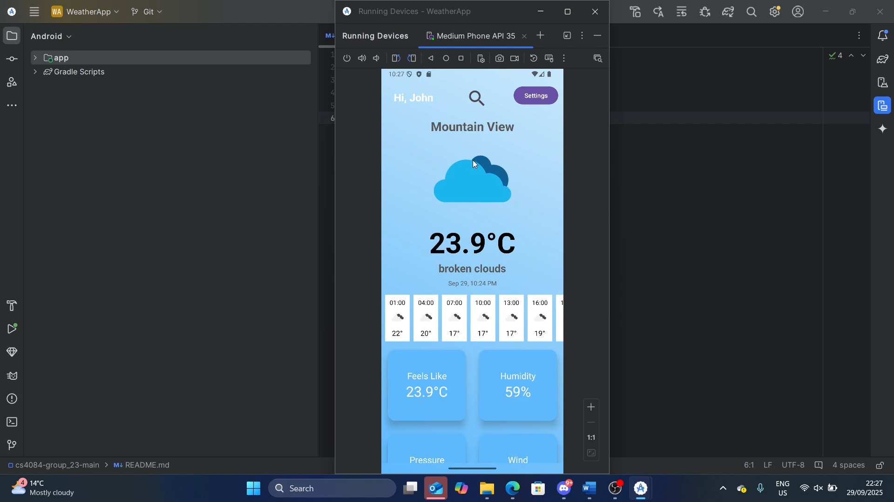

# Weather App – Mobile App Development Project

This project is an **Android weather application** developed using Android Studio. The app allows users to view current weather information, forecasts, and maps for various locations, with the ability to save favourite locations.  

Key features include:  
- View city weather on a map  
- Weather forecast display  
- Home page with current weather overview  
- Login and registration functionality  
- Persistent login preferences  
- Detailed weather info grid with swipe-to-refresh  
- Settings to change units and manage logout  
- Favourite locations management  
- Weather data backend integrated with available weather APIs  

---

## Development

- **Platform**: Android Studio  
- **Language**: Java / Kotlin (depending on project setup)  
- **UI Components**: Activities and Fragments for various features  
- **Persistence**: Preferences used to keep user logged in across app restarts  
- **Backend**: Weather API service for fetching weather data  
- **Features Implemented**:  
  - Activities: Home, Main, Register, Login/Logout, Settings, Favourite Locations, Weather Map, View City Weather  
  - Fragments: Weather Image, Forecast Search by Location  
  - Views: Weather forecast display, Detailed weather info grid  

---

## Project Deliverables

- Android Studio project source code  
- Functional GUI and navigation between activities/fragments  
- Persistent login preferences  
- API integration for real-time weather data  
- Screenshots and GIF demonstrating features  
- GitHub repository for version control and collaboration  

---

## Screenshots

**Settings Page**  
  
*Allows users to change units and logout from the app.*  

**Home Page**  
  
*Displays current weather forecast for user location.*  

**Login / Register Page**  
  

**Weather Map**  
  
*Users can pinpoint any location on the map and view a brief weather summary.*  

**Favourite Locations Feature**  
  
*Demonstrates bookmarking cities to a favourites section and viewing brief weather overviews.*  

---
